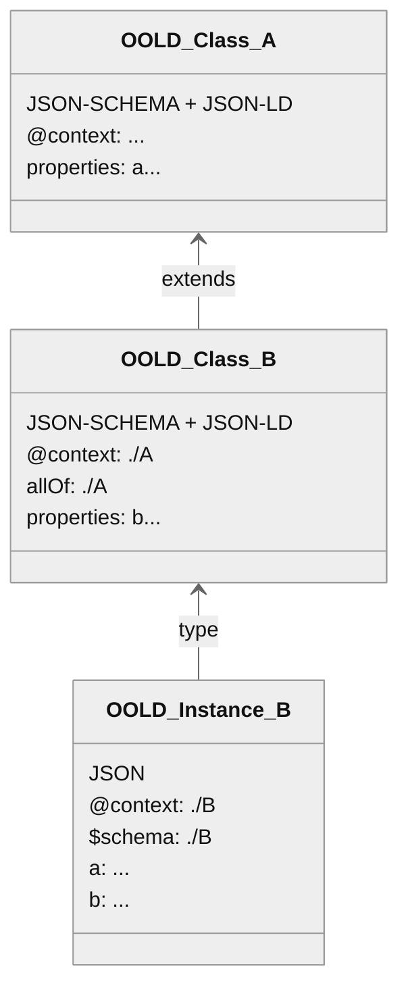

---
title: "Object Oriented Linked Data Schema"
abbrev: "OO-LD Schema"
category: info

docname: draft-stier-oold-schema-latest
submissiontype: IETF  # also: "independent", "editorial", "IAB", or "IRTF"
number:
date:
consensus: true
v: 3
# area: AREA
# workgroup: WG Working Group
keyword:
 - JSON
 - JSON-SCHEMA
 - JSON-LD
 - RDF
 - linked data
 - form generation
 - code generation
venue:
#  group: WG
#  type: Working Group
#  mail: WG@example.com
#  arch: https://example.com/WG
  github: "OO-LD/specification"
  latest: "https://OO-LD.github.io/specification/draft-stier-oold-schema.html"

author:
 -
    fullname: "Simon Stier"
    organization: Your Organization Here
    email: "52674635+simontaurus@users.noreply.github.com"

normative:

informative:


--- abstract

TODO Abstract


--- middle

# Introduction


The core idea is that an OO-LD document is always both a valid JSON-SCHEMA and a JSON-LD remote context ( != JSON-LD document). In this way a complete OO-LD class / schema hierarchy is consumeable by JSON-SCHEMA-only and JSON-LD-only tools while OO-LD aware tools can provide extended features on top (e.g. UI autocomplete dropdowns for string-IRI fields based e.g. on a SPARQL backend, SHACL shape or JSON-LD frame generation).

A minimal example:
```json
{
  "@context": {
    "schema": "http://schema.org/",
    "name": "schema:name"
  },
  "title": "Person",
  "type": "object",
  "properties": {
    "name": {
      "type": "string",
      "description": "First and Last name",
    }
  }
}
```

Please note that **OO-LD schema documents MUST not be interpreted as JSON-LD documents** because this would apply `@context` on the schema itself. The motivation behind this is to have a single document so schemas can be aggregated using both the JSON-SCHEMA `$ref` and the JSON-LD remote `@context` pointing the same resource.




# Conventions and Definitions

{::boilerplate bcp14-tagged}

## JSON Document

A JSON document is an information resource (series of octets) described by the application/json media type.
OO-LD Schema is only defined over JSON documents. However, any document or memory structure that can be parsed into or processed according to the JSON Schema data model can be interpreted against a OO-LD Schema, including media types like [CBOR](#rfc7049).

## Instance Document
A JSON document to which a OO-LD schema is applied is known as an "instance". OO-LD Schema is defined over `application/json` or compatible documents, including media types with the `+json` structured syntax suffix. Among these, this specification defines the `application/schema-instance+json` media type which defines handling for fragments in the URI.

## OO-LD Schema Document
A OO-LD Schema document, is a JSON document used to describe an instance. A OO-LD schema SHOULD always be given the media type `application/oold-schema+json` rather than `application/oold-schema-instance+json`. The `application/oold-schema+json` media type is defined to offer a superset of the fragment identifier syntax and semantics provided by `application/oold-schema-instance+json`.


# Security Considerations {#security}

Both schemas and instances are JSON values. As such, all security considerations
defined in [RFC 8259](#rfc8259) apply.

Instances and schemas are both frequently written by untrusted third parties, to
be deployed on public Internet servers. Implementations should take care that
the parsing and evaluating against schemas does not consume excessive system
resources. Implementations MUST NOT fall into an infinite loop.

A malicious party could cause an implementation to repeatedly collect a copy of
a very large value as an annotation. Implementations SHOULD guard against
excessive consumption of system resources in such a scenario.

Servers MUST ensure that malicious parties cannot change the functionality of
existing schemas by uploading a schema with a pre-existing or very similar
`$id`.

Individual JSON Schema extensions are liable to also have their own security
considerations. Consult the respective specifications for more information.

Schema authors should take care with `$comment` contents, as a malicious
implementation can display them to end-users in violation of a spec, or fail to
strip them if such behavior is expected.

A malicious schema author could place executable code or other dangerous
material within a `$comment`. Implementations MUST NOT parse or otherwise take
action based on `$comment` contents.

# IANA Considerations

## `application/oold-schema+json`

The proposed MIME media type for OO-LD Schema is defined as follows:

Type name:: application

Subtype name:: oold-schema+json

Required parameters:: N/A

Encoding considerations:: Encoding considerations are identical to those
specified for the `application/json` media type. See [JSON](#rfc8259).

Security considerations:: See {{security}} above.

Interoperability considerations:: TODO

Fragment identifier considerations:: TODO

## `application/oold-schema-instance+json`

The proposed MIME media type for JSON Schema Instances that require a JSON
Schema-specific media type is defined as follows:

Type name:: application

Subtype name:: oold-schema-instance+json

Required parameters:: N/A

Encoding considerations:: Encoding considerations are identical to those
specified for the `application/json` media type. See [JSON](#rfc8259).

Security considerations:: See {{security}} above.

Interoperability considerations:: TODO

Fragment identifier considerations:: TODO

# References

## Normative References

### [RFC8259] {#rfc8259}

Bray, T., Ed., "The JavaScript Object Notation (JSON) Data Interchange Format",
STD 90, RFC 8259, DOI 10.17487/RFC8259,         December 2017,
<<https://www.rfc-editor.org/info/rfc8259>>.

--- back

# Acknowledgments
{:numbered="false"}

TODO acknowledge.
